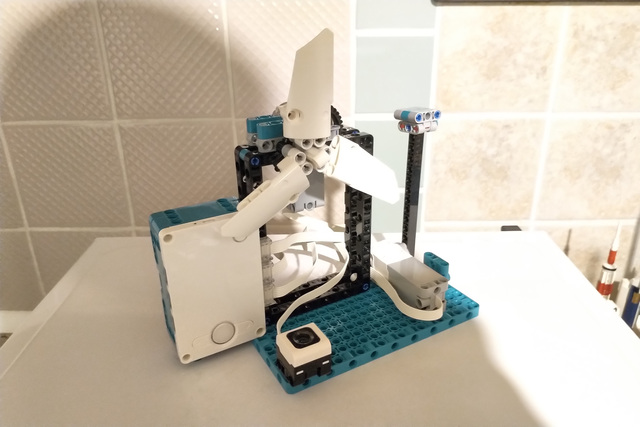

# robot-fan



The fan model built using LEGO® MINDSTORMS® Robot Inventor.

_**Disclaimer:** LEGO® and MINDSTORMS® is a trademark of the LEGO Group of companies which does not sponsor, authorize or endorse this project._

⚠️ _**Warning:** do not rotate the proportional control handle too fast to avoid damage to LEGO® MINDSTORMS® Medium Motor!_

## Features

- touch control to turn on and off:
  - based on LEGO® MINDSTORMS® Color Sensor;
- proportional control of the rotation speed:
  - based on LEGO® MINDSTORMS® Medium Motor;
- touch and proportional controls are independent.

## Testing

To run the unit tests, use the following command:

```
$ make test
```

## Building

For the convenience of uploading the script to the LEGO® MINDSTORMS® intelligent Hub, it is worth combining all parts of the project together.

To do this, use the following command:

```
$ make build
```

The resulting file will be available at path `builds/robot_fan.py`.

## Deploying

To deploy the building result, follow the steps below:

1. Create a new Python project in the LEGO® MINDSTORMS® Robot Inventor app.
2. Remove the whole default code.
3. Copy and paste the code from the building result (see file `builds/robot_fan.py`).

## License

The MIT License (MIT)

Copyright &copy; 2021 thewizardplusplus
